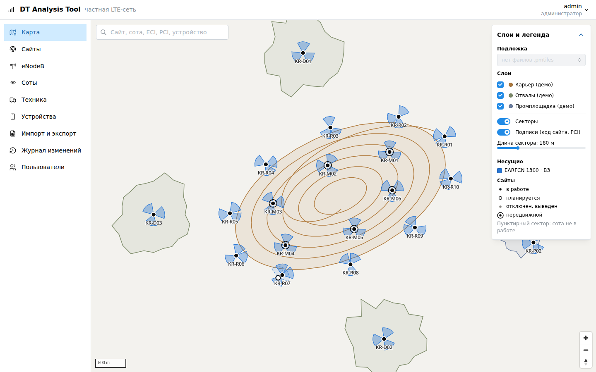
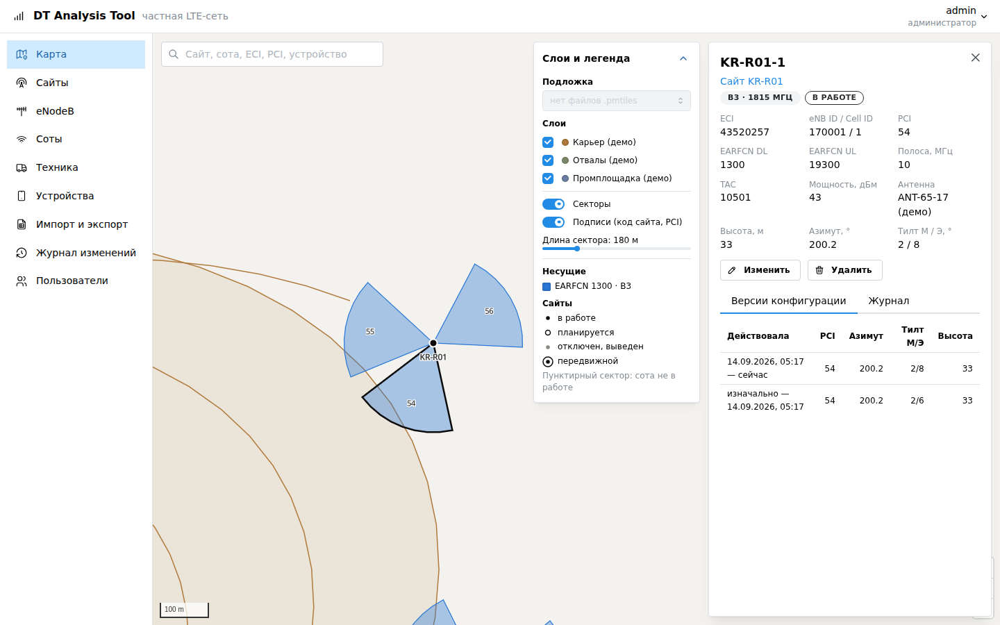

# DT Analysis Tool

Единая система для частной LTE-сети карьера: инвентаризация, драйв-тесты (офлайн и онлайн),
мониторинг качества связи со стороны абонента, работа с данными оператора, планирование покрытия.

**Статус:** этап 1 (фундамент, инвентарь, карта) в опытной эксплуатации; загружаются статистика KPI оператора и драйв-тесты NetMonitor.
См. [роадмап](docs/ROADMAP.md).



## Что уже умеет

- **Инвентарь:** сайты (в том числе передвижные, с историей перемещений), eNodeB, соты с версиями
  радиоконфигурации, техника, абонентские устройства. ECI и диапазон рассчитываются автоматически.
- **Журнал изменений:** кто, когда и через что поменял любой объект; дата изменения в сети задаётся задним числом.
- **Excel:** выгрузка, шаблон, загрузка с предварительной проверкой и построчными ошибками; файл применяется целиком
  или не применяется вовсе.
- **Карта без интернета:** секторы по азимутам, цвета по несущим, контур карьера и отвалы (GeoJSON), ортофото и OSM
  из файлов PMTiles; поиск по коду сайта, имени соты, ECI, PCI, IMEI.
- **KPI оператора:** загрузка почасового отчёта по сотам, сверка имён с инвентарём (статистика считается эталоном),
  проблемные соты по каждому показателю, раскраска карты по KPI, почасовые и суточные графики в карточке соты.
- **Драйв-тесты:** логи NetMonitor с телефона; трек на карте по RSRP, RSRQ, SINR или обслуживающей соте, линия
  до сектора, распределения, график по времени, соты и найденные проблемные участки (слабое покрытие, помехи,
  пинг-понг); неизвестные соты с подсказкой, какой eNB ID исправить.
- **Выносные секторы:** сота может стоять на другом сайте, чем её eNodeB (RRU, DAS в соседнем здании).
- **Роли:** администратор, инженер, просмотр.
- **Поставка:** один архив для ВМ без интернета; HTTPS, бэкап и восстановление скриптами.
- **Демо-данные:** синтетический карьер (22 сайта, 65 сот, 32 единицы техники) — `dtat seed-demo`.



## Документы

- [Архитектура](docs/ARCHITECTURE.md): ограничения, принципы, источники данных, компоненты, стек, модель данных
- [Роадмап](docs/ROADMAP.md): этапы, результаты, критерии готовности
- [Запросы данных](docs/DATA_REQUESTS.md): что запросить у оператора, маркшейдерии, эксплуатации и ИТ/ИБ
- [Разработка](docs/DEVELOPMENT.md): запуск, тесты, договорённости
- [Развёртывание](docs/DEPLOYMENT.md): установка на ВМ, подложки, обновление, бэкапы
- [Архитектурные решения (ADR)](docs/adr/)

## Быстрый старт (разработка)

```bash
docker compose -f deploy/docker-compose.dev.yml up -d
cd backend && cp .env.example .env && uv sync && uv run dtat migrate \
  && uv run dtat create-user admin && uv run dtat seed-demo && uv run uvicorn dtat.main:app --reload
cd frontend && npm ci && npm run dev    # http://localhost:5173
```

## Контекст сети

| | |
|---|---|
| RAN | Ericsson, FDD, 20+ сайтов |
| Транспорт | Ericsson |
| Ядро | Nokia |
| Кто эксплуатирует инфраструктуру | оператор связи; прямого доступа к OSS/NBI нет |
| Абоненты | LTE-роутеры на технике, PTT-рации (люди и техника) |
| Объект | карьер |
| Текущие инструменты | NetMonitor (Android), квартальные драйв-тесты оператора (Nemo) |
| Развёртывание | локальная ВМ, доступ в интернет ограничен |
