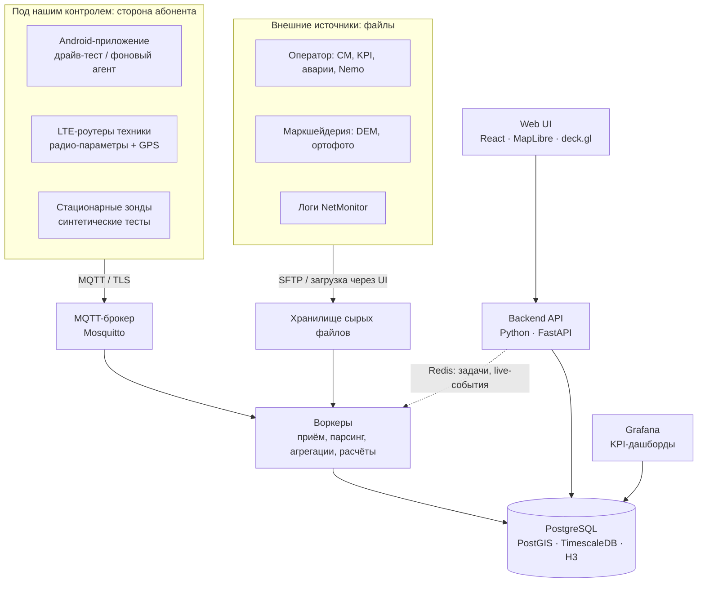

# Архитектура

## 1. Ограничения и что из них следует

| Ограничение | Следствие |
|---|---|
| Сеть (RAN, транспорт, ядро) эксплуатирует оператор, доступа к ENM/NBI нет | Основу строим **со стороны абонента**: устройствами владеем мы. Данные оператора получаем регулярными выгрузками по договорённости и подключаем как дополнительный источник, а не как фундамент |
| Объект — карьер | Рельеф меняется, мачты переезжают, техника постоянно объезжает рабочие зоны. Нужны DEM маркшейдерии, история положения сайтов, телеметрия техники как постоянный источник замеров |
| Локальная ВМ, интернет через ИБ | Всё работает офлайн: свои тайлы карты, никаких облачных зависимостей, поставка релизов архивом |
| Разработка вдвоём | Модульный монолит вместо микросервисов, минимум компонентов, готовые решения там, где они есть (Grafana, MQTT-брокер) |

## 2. Принципы

1. **Инвентарь — источник правды и точка связи.** Замер, KPI, авария и прогноз связываются через соту
   (ECI). Отсюда главная ценность системы: от плохого участка на карте к соте, её параметрам, авариям и изменениям.
2. **Каждый источник — адаптер.** Парсер приводит данные к общей схеме. Сырые файлы неизменяемы и хранятся,
   парсинг идемпотентный: после доработки парсера историю можно переобработать.
3. **Offline-first.** Устройства буферизуют данные при потере связи; сервер не требует интернета.
4. **История важнее текущего состояния.** Конфигурация сот и положение сайтов версионируются: для любого
   замера восстанавливается состояние сети на момент измерения.
5. **Время в UTC, координаты в WGS-84.** Местная система координат маркшейдерии используется при импорте
   и экспорте (pyproj / PostGIS).

## 3. Источники данных

| Источник | Что даёт | Канал | Зависит от |
|---|---|---|---|
| Наше Android-приложение | RSRP, RSRQ, SINR (RSSNR), RSSI, CQI, TA; ECI, PCI, EARFCN, TAC; соседи (PCI + EARFCN + уровни); GNSS; результаты ping / iperf3 / HTTP | MQTT с офлайн-буфером | нас |
| LTE-роутеры техники | радио-параметры модема, GPS, доступность | push по MQTT/HTTP или SNMP-опрос, зависит от модели | нас и эксплуатации техники |
| Стационарные зонды | доступность и качество сервиса во времени в ключевых точках | MQTT | нас |
| Логи NetMonitor | трек и радио-параметры | файл | нас |
| Оператор: таблица RND и CM-выгрузки ENM | параметры сот, соседства, физика антенн | файлы (SFTP / почта) | договорённости |
| Оператор: KPI / PM-счётчики | сетевые показатели по сотам | файлы | договорённости |
| Оператор: аварии | RAN, транспорт, S1 | пересылка онлайн или выгрузка | договорённости |
| Оператор: драйв-тесты Nemo | квартальные замеры | файлы `.nmf` | договорённости |
| Маркшейдерия | DEM, ортофото, система координат, план горных работ | файлы | предприятия |

Ограничения Android без root:

- нет L3-сообщений (RRC), UL-параметров и причин обрывов;
- частота обновления около 1 с, на части моделей реже;
- SINR — это RSSNR, и его корректность зависит от чипсета.

Поэтому для драйв-тестов фиксируем 1–2 эталонные модели телефонов, чтобы замеры были сопоставимы.

## 4. Компоненты

## 5. Стек

| Слой | Выбор | Почему |
|---|---|---|
| БД | PostgreSQL 16 + PostGIS + TimescaleDB + h3-pg | одна БД на всё: инвентарь, гео, временные ряды (сжатие, непрерывные агрегаты), бинирование по H3. Меньше компонентов на одной ВМ |
| Backend | Python 3.12, FastAPI, SQLAlchemy 2, Alembic, Pydantic 2 | экосистема RF-математики и гео (numpy, rasterio, pyproj, shapely), парсинг логов, типизированный API с OpenAPI |
| Фоновые задачи | воркеры на том же коде, отдельный процесс; очередь и расписание на Redis | парсинг файлов, опрос SFTP, агрегации, расчёт покрытия |
| Телеметрия | Mosquitto, MQTT с TLS | стандарт для нестабильных сетей: QoS 1, persistent sessions |
| Live-обновления | WebSocket + Redis pub/sub | онлайн-карта драйв-теста |
| Frontend | TypeScript, React, Vite, MapLibre GL JS, deck.gl, TanStack Query, Mantine | открытый картографический движок, работающий офлайн; сотни тысяч точек на GPU |
| KPI-дашборды | Grafana поверх TimescaleDB | не пишем то, что уже есть |
| Подложка | ортофото маркшейдерии + выгрузка OSM региона в PMTiles, раздаются своим сервером | без интернета |
| Android | Kotlin, Jetpack Compose, foreground service, Room, WorkManager, MQTT-клиент | нативное API телефонии, надёжный офлайн-буфер |
| Вход | Nginx, TLS от внутреннего CA | единая точка входа |
| Поставка | Docker Compose; релиз = образы (`docker save`) + compose + миграции | офлайн-установка на ВМ |
| Качество | uv, ruff, mypy, pytest + testcontainers; ESLint, Prettier, Vitest; ktlint, detekt; pre-commit; GitHub Actions | стандартные практики, проверка на каждый push |

Решения, которые меняют архитектуру, фиксируем в `docs/adr/` (Architecture Decision Records).

## 6. Модель данных (ключевые сущности)

- **site** — площадка: координаты, тип (стационарная / передвижная), высота опоры, статус.
  `site_position_history` хранит перемещения передвижных мачт.
- **enodeb** — eNB ID, сайт, оборудование, версия ПО.
- **cell** — ECI, PCI, EARFCN DL/UL, полоса, TAC, мощность; антенна: модель, высота, азимут,
  механический и электрический тилт. Версионируется (`valid_from` / `valid_to`).
- **neighbor_relation** — соседства (из CM и наблюдаемые по замерам).
- **device** — абонентское устройство: тип (телефон / роутер / рация / зонд), IMEI, модель, закрепление за техникой или ролью.
- **asset** — единица техники.
- **session** — сессия драйв-теста; источник: наше приложение / NetMonitor / Nemo.
- **measurement** (гипертаблица) — время, устройство, сессия, точка, точность GNSS, скорость;
  обслуживающая сота (ECI, PCI, EARFCN, TAC); RSRP, RSRQ, SINR, RSSI, CQI, TA; соседи (JSONB); ссылка на распознанную соту.
- **test_result** (гипертаблица) — ping / iperf3 / HTTP: RTT, потери, скорость.
- **kpi** (гипертаблица) — сота, период, показатель, значение.
- **alarm** — источник, объект (сайт / сота / линк), критичность, время возникновения и снятия.
- **raw_file** — каждый принятый файл: источник, sha256, время, версия парсера, статус обработки.
- **terrain_layer** — версии DEM и ортофото по датам съёмки.
- **change_log** — аудит: кто, что и когда поменял, включая изменения оператора, найденные при сверке CM.

### Привязка замеров к сотам

- Обслуживающая сота определяется по ECI (28 бит = eNB ID × 256 + Cell ID). Android отдаёт его напрямую
  (`CellIdentityLte.getCi()`), Nemo и NetMonitor тоже.
- Соседи известны только по PCI + EARFCN: сопоставляем с ближайшей сотой с такой парой.
- Сота берётся в версии, действовавшей на момент замера.
- Нераспознанные ECI / PCI попадают в отдельный список. Это признак устаревшего инвентаря или изменений на стороне оператора.

### Бинирование

Замеры агрегируются в гексагоны H3: разрешение 11 (ребро около 25 м) для обзорных карт,
разрешение 12 (около 9 м) для детального анализа. Сравнение драйвов и накопительные карты строятся по бинам.

## 7. Специфика карьера

1. **Рельеф меняется.** SRTM и Copernicus (30 м, давние съёмки) актуальный карьер не отражают. Используем
   DEM маркшейдерии (дрон, лазерное сканирование) с версиями по датам и пересчитываем прогноз после новой съёмки.
2. **Модель распространения.** Статистические модели (Hata, COST-231) для карьера не годятся. Определяют всё
   прямая видимость и дифракция на бортах и уступах. Нужен расчёт по профилю рельефа (LoS + дифракция по
   ITU-R P.526), откалиброванный по накопленным замерам.
3. **Передвижные сайты.** Мачты переезжают за фронтом работ, поэтому положение сайта хранится с историей.
4. **Техника как зонды.** Роутеры на самосвалах и экскаваторах каждый день проходят все рабочие зоны. Их
   телеметрия даёт ежедневно обновляемую карту покрытия именно там, где идёт работа.
5. **Uplink.** Техника в основном отдаёт данные (телеметрия, видео), и ограничивает часто UL. С телефона
   UL-SINR не измерить, поэтому нужны UL-тесты iperf3 и счётчики UL-помех оператора (`pmRadioRecInterferencePwr`).
6. **Подложка.** Ортофото маркшейдерии актуальнее любых публичных карт.

## 8. Развёртывание и поставка

- **ВМ.** Linux (уточнить: Ubuntu / Astra / РЕД ОС); ориентир 4–8 vCPU, 16 ГБ RAM, 200+ ГБ SSD.
  Объём: 50 устройств × 1 замер в 5 с ≈ 0,9 млн строк в сутки ≈ 100 ГБ в год до сжатия, 10–20 ГБ после сжатия TimescaleDB.
- **Путь данных от устройств:** UE → LTE → ядро → APN → сеть предприятия → ВМ. Интернет не нужен.
  Нужен маршрут из APN до ВМ и открытый порт (MQTT/TLS 8883 или 443).
- **Поставка.** GitHub Actions собирает и тестирует. Релиз — архив с образами (`docker save`), compose-файлом,
  миграциями и контрольными суммами. Архив переносится на ВМ и ставится скриптом. Если ИБ разрешит
  внутренний registry, упростим. Android — подписанный APK, установка вручную или через MDM.
- **Бэкапы.** Ежедневный дамп БД и архив сырых файлов, с периодической проверкой восстановления.
- **Время.** Устройства синхронизируются по GNSS / NTP.

## 9. Безопасность и персональные данные

- TLS на всех каналах; у каждого устройства своя учётная запись MQTT; роли в интерфейсе
  (администратор / инженер / просмотр); позже — вход через AD / LDAP.
- Агент на телефонах и рациях сотрудников даёт трек их перемещений. Это нужно согласовать с ИБ и юристами.
  В системе устройство привязывается к технике или роли, а не к ФИО; треки хранятся ограниченное время.

## 10. Разработка

- Монорепо: `backend/`, `frontend/`, `android/`, `deploy/`, `tools/`, `docs/`.
- Разработка идёт без доступа к сети предприятия, поэтому нужен **генератор синтетических данных**: модельный
  карьер с сайтами, сотами, маршрутами техники и замерами по упрощённой модели. Плюс реальные образцы
  файлов, переданные вручную (при необходимости обезличенные).
- CI на каждый push: линтеры, проверка типов, тесты, сборка образов.
